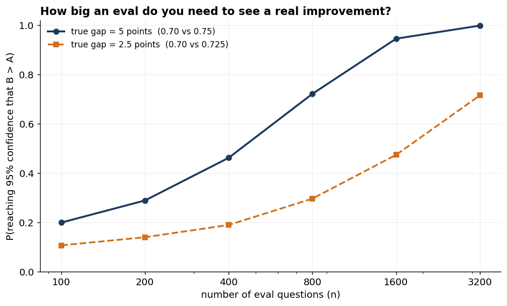

# Your AI Eval Isn’t a Test. It’s a Measurement.

### Why the unit-test instinct quietly fails when you're measuring an AI feature on a few hundred examples — and a way of thinking about it that non-statisticians can actually follow

I once advised a major retailer not to ship a customer-assistant chatbot that had only ever been vibe-tested. They shipped it anyway, and found it quietly drove customers away from the search and recommendation systems they had spent years tuning; conversions fell and money was lost. After rolling it back, they then asked the question that should have come first — how should we be evaluating this?

Not so long ago, evaluation wasn't controversial. Across the data-science and machine-learning teams I've been a part of, measuring what we built was simply part of the job — we didn't ship a model we hadn't evaluated. Sometimes the metrics were legible to everyone: in computer vision, a model, a set of images, and an accuracy that outsiders grasped at once, with precision and recall a sentence or two behind. Sometimes they weren't legible at all — anyone who has tried to explain a recommender system's NDCG to a stakeholder knows the number can be a black box even to the team reporting it. But the practice itself was never in question. The argument was never *whether* to measure; at most it was about what the number meant.

Then, language model APIs arrived and became something we could build with in an afternoon. Teams stood up retrieval-augmented prototypes overnight, and almost all of them were evaluated the same way: by eye. A stakeholder would see a convincing demo on two or three examples and want it in production; many engineers newly arrived from application development — without the measure mindset a data scientist takes for granted — were happy to oblige.

On top of this, evaluation had genuinely gotten harder. In vision, there was usually a ground truth; here, we were generating free text from a corpus, with no single right answer and plenty of room for subjectivity. So the practice didn't just fail to keep up — it went into reverse. The default became a thumbs-up and thumbs-down in the UI, a number nobody examined too closely, and a vague promise of collecting user feedback. The need to measure hadn't gone anywhere — if anything, a system whose answer can change from one run to the next needs more measurement than a deterministic classifier, not less. What slipped was adherence, not necessity: building got easy, the demos got seductive, and even people who knew better stopped putting as much effort into measuring, exactly as the thing being measured got harder to pin down.

The instinct is coming back, though. As systems grow more ambitious — agents, tool calls, multi-turn conversations — we are beginning to see more rigorous evals again, because crisp questions naturally emerge: did it call the right tool, did the conversation reach the right outcome? On a recent contact-centre project, our engineers were comfortable defining mock user journeys and scoring them against expected outcomes — and they were the ones convincing the customer, still wedded to manual QA, that this deserved sustained effort. Increasingly, the job is persuading customers that this investment will enable them to move faster in the long run, even though it may feel like a slowdown at first. Once it's in place, I've heard the same satisfied realisation more than once, and on more than one project: "I get it — these are like unit tests for AI models."

That realisation is useful, but it is also where the next mistake starts. The industry is rebuilding eval discipline, but it is often importing too much of the software-testing mental model with it: *green means safe, red means broken, higher means better*. That instinct comes from good engineering hygiene, and the seed of it is right; anyone who has chased a *flaky test* understands the discomfort of a result that does not reproduce consistently.

Individual eval cases can be binary, and a suite can still have a release gate. But when we move from a single scored example to an **aggregate eval score**, the test metaphor starts pointing at the wrong object. An eval score is not a deterministic verdict; it is an uncertain measurement, and the next maturity step is learning to read it that way.

A language model is a stochastic system — and not only when we turn the temperature up. Even at temperature zero, and even with a fixed seed, many production setups will still give us different answers to the same prompt. That's because the nondeterminism is baked into how inference runs at scale, not just into the sampling step ([Thinking Machines lays this out well](https://thinkingmachines.ai/blog/defeating-nondeterminism-in-llm-inference/)). Run the same question twice and we may get two different results; score a hundred questions and the number we get is one draw from a distribution of possibilities. The uncertainty comes from both sides: the model's token predictions can vary, and our eval questions are only a sample of the situations the system will face. **That's what a measurement is: an uncertain quantity that comes with error bars whether we draw them or not.**

When we treat a measurement as a verdict, we make confident decisions on numbers that were mostly noise: we ship a "regression fix" based on eight examples, we tell a customer model B is better when the difference is well inside the margin of error, we celebrate a metric rising by a degree that would not survive running the suite again the next day. The model is rarely the problem. The measurement is.

Once we see the number as a measurement, the questions change. The instinct — whether we're checking the score is green or driving a metric ever higher — is to treat the number as the system's capability itself: the thing to maximise, report, defend. But it isn't the capability. **It's a noisy *estimate* of a true underlying capability we can't observe directly** — or, if we think in Bayesian terms, our *current belief* about that capability.

So we stop reading the score as the verdict and start asking what it's hiding. Were these the right questions to ask, and enough of them? How much would the number move if we ran it again? Is the shift we're observing a real gain, or the kind of wobble that twenty examples will throw off by chance? None of that is visible in the raw score. The discipline that's missing isn't a fancier harness — it's a way of thinking about uncertainty in systems that don't behave consistently.

By "eval" I don't mean the big public benchmarks — MMLU, the leaderboards, the thousands-of-questions academic suites. I mean the everyday practice of measuring whether an AI system does its job: a few dozen to a few hundred graded examples for a feature or an agent, assembled during delivery, run again every time we change a prompt or swap a model. That scale is where most real work happens, and — as we'll see — it's exactly the scale at which the statistics stop being a formality.

One thing that we should keep in mind: this post is about how much to trust the number an eval gives us, not about whether the eval is measuring the right thing in the first place. Whether a gain on your eval corresponds to a gain your stakeholder actually values — whether the questions are representative, the labels sound, the metric aligned with the work — is a prior question, and no amount of the statistics here will rescue an eval that measures the wrong thing precisely. I'm taking the eval's validity as given and asking what its score is worth: the *inner loop* of iterating against a fixed eval, not the *outer loop* of establishing that it's the right eval to begin with. That outer loop matters at least as much, but it's a different article — or rather, two. The upstream half — deciding what the work is meant to prove, and agreeing the success criteria an eval exists to score — is what I've written about in [Hypothesis-Driven AI Delivery](https://chris-hughes10.github.io/writing/hypothesis-driven-ai-delivery/). The other half, whether the eval itself is a valid instrument for those criteria, is still on my list.

I also lean on the word itself three ways: an **eval** is the whole exercise — a graded set of examples and the score it produces; the individual graded examples are **eval questions**, often pass/fail; and the **eval score** is the aggregate over them. It's the aggregate that's the measurement.


> **If you read nothing else.** Three things, in plain English:
> 1. A single eval question may be pass/fail, but the *score* — the aggregate over many of them — is a *measurement*, not a verdict: a noisy estimate of the system's true capability, with a margin of error (from the model's token-level randomness, and from having sampled only so many questions). Treating the number as the capability itself is the core mistake.
> 2. Small eval sets are far noisier than they look. A 400-question eval is often still underpowered for the few-point improvements teams usually care about, and most enterprise eval sets are smaller than that.
> 3. The fix isn't a fancier harness. It's reporting a number *with its uncertainty*, ideally as a plain-English probability — "B is probably better, about 72% likely" — and making decisions on that, not on a bare number.
>
> The rest of this article discusses how to do that, and when it actually matters — in plain language, with runnable code throughout. If you skip every code block you'll still get the argument.


## The perspective change: from verdicts to measurements

You don't need to become a statistician to make use of this article, and I'm not asking you to throw out any methods you may already have. The standard toolkit — confidence intervals, standard errors, paired comparisons, power analysis — is perfectly good, and for a large, clean eval may be the simplest approach. Evan Miller's *Adding Error Bars to Evals* lays it out for this setting, and Cameron Wolfe has written a thorough, code-first walkthrough I'd read alongside this. None of the machinery below is novel either.

What I am asking you to change is what you think an eval score *is*. A score is not the system's capability. It is evidence about that capability, gathered through a limited and noisy measurement process. Once you see that, the question changes from *"did the eval pass?"* to *"what does this measurement actually support?"* That is the perspective shift this article is trying to make useful: not more statistical ceremony, but better judgement under uncertainty.

It took me a while to see why this mattered day to day. I spent a long time with the standard treatment in the articles above, and even with a maths background I found myself thinking: yes, error bars make sense, but how does this change the decision I make on a project tomorrow? What made it click was reframing every question as one about *belief under uncertainty*. The question I actually have is rarely *"what is the 95% confidence interval."* It's *"how likely is it that B is better than A,"* or *"given how little data I have on these edge cases, what should I believe about the error rate."* Those are questions of belief, and they come out in plain English: *a probability you can act on*.

So this is an on-ramp, not a manifesto — and it's worth being precise about what it asks you to reflect on. One is the *stance*: that an eval is a measurement with error rather than a verdict, reported with its uncertainty and said as a probability someone can act on. That part I'm asking you to adopt everywhere; it doesn't weaken at any sample size, and there's no *n* at which you go back to reading the bare number as a result.

The other, which matters far less, is the *arithmetic* underneath: the particular formula you run to turn the data into a number. That's closer to an implementation detail, and I'll come back to it only where it earns its keep: small samples, success rates pressed up near 0% or 100%. On a large, clean eval the competing formulas agree to the decimal and the choice makes no difference at all. The perspective is the contribution; the specific maths is just the most convenient way to put it to work. And where the maths does matter, one preference runs through all of it: if the problem admits a closed-form answer — a conjugate pair you update with a line of arithmetic — that is almost always the one to reach for, being exact, reproducible, and trivially cheap to update as fresh data arrives. The heavier sampling machinery earns its place only where no such closed form exists for the quantity we actually want: once a model has to learn how alike its groups are, share strength across thin slices, or weigh two models on the logit scale. Never as the default.

The aim isn't to make evals more elaborate. It is to stop them misleading us, and to say what they tell us in language the room can use.

## Why this matters most when the data is messy

In the field, data is small and expensive to label, the success rates hug zero or one, the examples arrive correlated rather than independent, the grader is often itself a fallible model, and a decision rides on the number tomorrow. Where a research lab may have huge public benchmarks, peer review, a culture that expects error bars, and colleagues who flag an overclaim before it leaves the building, the further we get from that environment the thinner those supports become — and forward-deployed, where I've spent most of my time, they're gone entirely, and the stakes are higher. That's the world I'll draw my examples from: where the mess is densest and the safety nets fewest.

Start by considering the data, which is at the foundation of everything else. A lab may evaluate on thousands of questions; we may have twenty. On the first RAG system I built, I asked the customer's subject-matter experts for curated question-and-answer pairs, and what came back — beautifully judged, and clearly hard-won — was twenty of them, with little appetite to produce more. (We ended up generating more with an LLM and having the experts review those, which always felt a little like marking our own homework.) That's the normal case, not the unlucky one: the eval is specific to one customer's workflow, and every label costs a domain expert an hour they didn't have. The small-sample, boundary-hugging regime this post keeps returning to isn't an edge case in these contexts — it's the permanent condition. "Is B better than A" isn't a release-day ceremony, it's every prompt tweak measured against last week's version on those same twenty examples. The careful methods a researcher reaches for once a year are the ones we need most weeks.

Then there's what a wrong number costs. When a lab's eval misleads, the damage is internal and recoverable — a dead-end ablation, a line in a paper. In a forward-deployed context, when ours misleads, we've told a paying customer their system improved when it didn't, or shipped a regression into something they depend on. The currency of this work is the customer's belief that we know what we're doing, and a confidently-wrong number spends it fast. Worse, we may be the only ones equipped to catch it: there's no reviewer, no stats-literate colleague, so the discipline is self-imposed or it doesn't happen. And then we roll off, leaving the eval to be run and read by a customer's team less practised than us. An eval only we can interpret correctly becomes a liability the day we depart, which is exactly why saying the result in plain language isn't polish. It's how the work survives us.

So we have to *be* the error bar ourselves, because nothing around us will draw it for us. Even the raw material is on us: on a recent project building an AI stylist, we pushed hard for time with the customer's real stylists to ground the evaluation, couldn't get it, and ended up building the eval sets ourselves — which is how these things usually go. That's the why; everything that follows is the how.

## A note on method: no real model required

Everything below runs on simulated data, and that's a deliberate choice rather than a shortcut. The post is about the statistics of eval *outcomes* — correct or incorrect per question, a few repeated samples, two models on the same questions, judge labels against ground truth. None of that needs a live LLM, and using one would only add cost, nondeterminism, and a result we can't reproduce. More importantly, when we plant the true parameters ourselves, we can check that the inference actually recovers them. With a real model we never know the truth, so we can never demonstrate that the method works — only that it ran. That habit of writing down the data-generating process first is one of the most useful things I've taken from the Bayesian literature, so it seemed right to build the post on it.

If you'd rather take the code than read about it, you can: all the worked examples, the figures, the prior-sensitivity and calibration checks, and the cross-validation against an independent library live in [the companion repository](https://github.com/Chris-hughes10/eval-blog), which you can clone and reproduce with a single command. The snippets in the post are lightly trimmed for reading; the repo is the source of truth.

A little shared setup for everything that follows:

```python
import numpy as np
import scipy.stats as st
import pymc as pm

RNG = np.random.default_rng(7)     # seed for the planted data — any fixed value, for reproducibility
SAMPLE = dict(draws=2000, tune=2000, chains=4, cores=1,   # 2000 draws after 2000 warm-up steps;
              random_seed=7, progressbar=False)           # 4 chains, single-core -> stable, reproducible re-runs

def ci(s, lo=2.5, hi=97.5):        # a 95% interval from posterior draws
    return np.percentile(s, [lo, hi])
```

**A word on where the numbers come from**, because the examples are full of them.
- The constants drawn with `RNG` or `rng_*` are the *planted truth* — the data-generating values I invent precisely so I can check the inference recovers them, chosen to be a plausible scenario rather than anything sacred (a system around 70–85% accurate, questions of mixed difficulty).
- The constants inside a `with pm.Model()` block — PyMC's name for the statistical model, not the AI system under test — are *priors*: what we believe before seeing the data. I keep those deliberately *weakly informative*: mild enough that even twenty or fifty real examples outvote them, and shaped to fit the quantity — a probability gets a `Beta` (which can't stray outside 0 to 1), a non-negative spread a `HalfNormal`, a concentration — how alike the groups are — a `Gamma` (always positive, and chosen so we don't start out assuming the groups have nothing in common), and a number free to range either way a `Normal`. Where a prior is most likely to influence a result is the LLM judge — the most information-hungry of these — and the appendix shows that even there, any reasonable prior barely moves it.

One small reading convention: every seed (`default_rng(7)`, `(21)`, and so on) is just a fixed arbitrary number so the run reproduces; nothing rides on its value.

What follows is a series of short demonstrations of the same shift in stance — from reading the bare number to asking what it could actually support. Each one takes a moment where the *verdict* instinct gives a confident answer, shows what the *measurement* was really telling you, and ends with the sentence I'd actually say to a stakeholder about it. Each block of code is followed by a plain-English reading of it and a table of what it found; if Python isn't your idiom, read those and skip the code — you'll lose nothing of the argument. They need you to treat the number as a draw, not a verdict.

When we say "model B versus model A" below, read it as "two versions of your system," because in practice the comparison we run most is our own prompt or pipeline against our previous iteration.

## What can a single accuracy actually tell you?

Let's take the most basic thing an eval produces: an accuracy. The model got 47 of 50 questions right. Suppose we are looking to introduce some statistical rigour.

The natural move is to put a margin of error around it — a *standard error*, which is just a measure of how much that 47/50 would jump around if we happened to draw a different fifty questions — and stretch that into an interval; a *confidence interval*. The textbook way to draw one is a symmetric bar the same distance either side of the score: the *normal-approximation* interval. (We'll also see it called the *Wald* interval.) In code, it's just the observed score give or take 1.96 standard errors:

```python
def wald(correct, total):                     # the textbook bar: symmetric, can fall off [0,1]
    p = correct / total                       # observed accuracy
    se = np.sqrt(p * (1 - p) / total)         # how much p would bounce on a fresh batch of questions
    return p, (p - 1.96 * se, p + 1.96 * se)  # ±1.96 SE (the 95% z-score) — nothing stops this exceeding 1
```

For a healthy sample sitting comfortably away from the extremes — an accuracy well clear of 0% and 100% — it can work fine. The trouble is that such a sample is exactly what we *rarely* have: our 47 out of 50 is 94%, already crowding the upper edge. In industry, we are rarely sitting on ten thousand labelled examples for some niche workflow. We may have fifty if the budget stretched, and as often half that — painstakingly assembled with a domain expert who has a day job, as we saw earlier.

Set the small samples aside for a moment, because the textbook interval carries a deeper communication challenge. Tell a stakeholder "the 95% confidence interval is 79% to 98%" and the thing they picture is *"there's a 95% chance the true accuracy is between 79 and 98 percent."* That is the sentence they want, but a confidence interval doesn't quite give it to them. A confidence interval is a promise about the method over many repeats: if we kept drawing fresh sets of fifty questions and building intervals the same way, about 95% of those intervals would contain the true accuracy. The interval in front of us simply does or doesn't contain the truth.

A **credible interval** is the one that says what people usually mean: given the data and the assumptions we wrote down, this is the range we believe the true value sits in with 95% probability. Most rooms want the second object, not the first. So the job isn't to teach the room a counterintuitive idea; it's to reach for the tool that already means what everyone assumes. That tool works straight from belief.

First, three pieces of vocabulary, in plain terms, because the rest of the post leans on them. The **prior** we met back in the setup — what we believed before seeing the data, here the mild `Beta(2,2)` that says the true accuracy could go either way and we're far from sure.

> You may be wondering: why `Beta(2,2)` in particular, and what do its two numbers mean?
>
> Read them as imagined evidence: the prior is the belief we'd hold after pretending we'd already seen two questions go right and two go wrong — exactly the `prior_wins=2, prior_losses=2` in the code. Two things about that choice matter. First, the counts are *equal*, so the prior leans neither for nor against the model; nothing in it flatters the result. Second, they're *tiny* — four imagined questions are a feather on the scale, so the moment real data arrives, even our fifty, it outweighs the prior many times over and the posterior follows what we actually measured. Why not the perfectly flat `Beta(1,1)`, which assumes nothing at all? The catch is that "assume nothing" really means "treat 100% as just as believable as anything else, before we've seen a single question" — so when a small lucky run lands, five right out of five, nothing pulls the estimate back from the ceiling, and five questions are allowed to suggest near-perfection. `Beta(2,2)` is only a shade less flat: a gentle hump that holds almost no belief at the exact extremes and leans faintly towards the middle. That faint lean is just enough to make five-out-of-five read as *high, but nowhere near certain* rather than crowding 100% — and far too weak to leave a mark once real counts pile up. That is the whole job of the prior: to keep the answer sane without taking a side on how good the model actually is. Tilt the two counts optimistic or pessimistic and, as the appendix shows, any reasonable choice lands in much the same place — only a lopsided, confident prior moves the result, and then it does so in plain sight, where we can defend it.


The **posterior** is our updated belief after the data arrives, and the 95% **credible interval** we read off it is the honest replacement for the bare score: not just the 94% we observed, but how much room fifty questions leaves around it — here, a band from roughly 82% to 97% — note the 94% sits high in that band, not at its centre; near the boundary the posterior leans back from the ceiling, which is the whole point.

The code below calculates this — `beta_posterior` starts from the mild prior, adds what we actually observed (`correct` out of `total`), and reads off the updated 95% range. That's the whole motion: believe something vague, see data, update. It buys a second thing almost for free: because that `Beta` curve lives only between 0 and 100%, its interval can't fall off the end of the scale — which, as we're about to see, is exactly what the textbook bar does once the score crowds an edge.

```python
def beta_posterior(correct, total, prior_wins=2, prior_losses=2):
    losses = total - correct                          # the rest were wrong
    post = st.beta(prior_wins + correct,              # imagined wins  + real wins
                   prior_losses + losses)             # imagined losses + real losses
    return post.mean(), post.ppf([0.025, 0.975])      # point estimate, then the 2.5%/97.5% cut points — the 95% in between, and it can't leave [0,1]
```

Run the two approaches side by side and the boundary problem is easy to see:

| observed | naive (Wald) 95% interval | Beta(2,2) 95% credible interval |
|---|---|---|
| 47 / 50 | [0.874, **1.006**] | [0.818, 0.969] |
| 50 / 50 | [1.000, 1.000] | [0.899, 0.995] |
| 940 / 1000 | [0.925, 0.955] | [0.923, 0.952] |

At 47/50 the naive interval puts its upper bound above 100%, which is impossible. At 50/50 it collapses to a single point, [1.000, 1.000] — declaring the model flawless on the strength of fifty questions, which is worse than useless. The belief-based version can't fall into either trap. A Beta posterior is a full distribution that lives only between 0% and 100%: at 50/50 it still reports a spread of plausible values rather than collapsing to a point, and its interval can never run past the ceiling. No special cases, no fudging at the edges.

The boundary failure, though, is the fault of the *crude* Wald interval — which is, admittedly, the one most people actually use. Better frequentist intervals (Wilson, Clopper–Pearson) avoid it with no prior in sight (the appendix has the details). But which interval we pick isn't really the point: none of them fixes the *interpretation*. A confidence interval still doesn't mean what the room thinks it does — and that's the real reason I reach for the credible interval, the one that also means what we'll say out loud.

**What you say in the room.** *"We got 47 out of 50, but on only fifty questions the honest range is something like 82% to 97% — we can't claim better than that yet."* The number with its uncertainty, in one breath.

## How many questions do you actually have?

Every interval in the last section rested on a quiet assumption: that each question is an independent draw, so fifty answers are fifty separate pieces of evidence. In real evals that rarely holds — questions arrive in bundles that share some underlying dependency, and a bundle carries less independent information than its size suggests. So the number that really sets the width of our error bars isn't how many questions we scored; it's how many *independent* ones they amount to. That's what this section is about: counting how much independent evidence we've actually got.

To do this, we need to identify which questions aren't really separate evidence, the ones that rise and fall together. The concept for this is a **cluster**, a set of questions whose scores tend to move together for a shared reason, beyond the model simply being good or bad in general. A key distinction: *a cluster is not a topic.* It is not necessarily a grouping by subject matter — two questions on quite different topics can sit in the same cluster, as long as their scores move together for some concrete shared reason.

Here's the way that I think about this. If I told you the model got question A wrong, would that change what you expect on question B — for some shared reason other than "I suppose the model's a bit weak"? If yes, that's evidence A and B belong in the same cluster. The obvious case is turns in the same conversation, which nobody needs persuading of. The shared reason can be less obvious, though: they draw on the same source data — a document, a catalogue record, a knowledge-base entry — they route through the same tool or integration, or they're the same prompt in different languages.

Take an AI stylist agent that my team built to recommend products and outfits. We evaluated it with persona conversations both scored turn by turn and at a conversation level — the turns cascade, but that's the obvious cluster. The cluster that quietly distorts the error bars lives one level down, in the data the agent reasons over through its tools: a product catalogue it searches and a graph of which customers have interacted with which products. Suppose many of a few hundred eval questions end up surfacing the same catalogue records, and that where a record is stale, mislabelled, or out of stock, every recommendation that surfaces it tends to fail together — whichever persona is asking, whatever the outfit. Those failures still get logged as separate passes and failures, appearing as independent evidence. Notice that this cluster is *not a topic*: a winter coat and a sundress, scored in different conversations, can fail for the single shared reason that their catalogue data is bad.

Grouping the eval into clusters doubles as a free coverage check. In some cases, we may find that we *can't* extract distinct clusters at all — every question leans on the same few data sources and routes through the same one tool, so everything correlates with everything. That isn't a problem we can compute our way out of; it's a coverage problem: the eval is probing one narrow thing many times over, however broad we hoped it was. The honest position usually sits between the extremes — not one big cluster, because genuinely different data, tools, and personas buy real independence, but nowhere near the number of independent questions the size of the eval suite claims. Finding those genuine groupings is the work, and far better to discover the eval's narrowness at the whiteboard than in production.

Watch this happen to a real number — the correction is larger than people expect. Suppose our 300 eval questions lean on 50 catalogue records — six to a record — and a record's data quality sets how well the agent does on everything that touches it. We plant two plain quantities. The **overall accuracy** is the agent's average pass rate across the whole eval — the single headline score, here 74%. The **concentration** says how much record quality varies: high means every record is about equally good, low means quality is all over the map — some records pristine, others stale or wrong. We set it low, so a real tail of poor records each sink the six questions that lean on them. These planted values are the *truth*, usually unobserved, set so that we can check the inference recovers them.

We then estimate that overall accuracy two ways, and both give a 95% **credible interval**:
-  The **naive** reading pretends all 300 questions are independent: reusing the `beta_posterior` from the single-accuracy example, run on the raw count of passes — a `Beta(2,2)` prior updated by that count. (That Beta-prior-plus-Binomial-count setup is the usual Beta-Binomial model.)
-  The **clustered** reading writes the structure down instead: an overall accuracy, a *concentration* it *learns* from the data rather than assuming, and record-level variation folded into the likelihood for each record's passes out of six. Conceptually, this is still one accuracy per record drawn from the shared family, with that record's six questions testing it; the code uses the equivalent Beta-Binomial form, which integrates those record accuracies out. The overall accuracy we want is a parameter of this model directly, so we just read its posterior off, and it comes out honest because the model knows those 300 questions came from only 50 independent records.

The code has three parts:
- First, it **generates a fake eval**: from the planted truth it rolls each record's accuracy, then the pass counts an eval would actually log (`passes_per_record` — 50 numbers, each between 0 and 6).
- Then, it **infers** the overall accuracy from those counts, and only those, two ways: the naive reading reuses `beta_posterior` from before, the clustered reading is one new function.
- Finally, it turns the two error bars into an **effective sample size**:

```python
rng_cluster = np.random.default_rng(202)
n_records, questions_per_record = 50, 6                  # 300 questions, six leaning on each record

# GENERATE fake eval data.
# The `true_*` values are the hidden ground truth
true_overall_acc, true_concentration = 0.74, 2.0         # overall pass rate 74%; low concentration -> quality varies widely
true_record_acc   = rng_cluster.beta(true_overall_acc * true_concentration,
                                     (1 - true_overall_acc) * true_concentration, size=n_records)   # each record's own accuracy

# Generated `passes_per_record` is the only thing the inference below will see.
passes_per_record = rng_cluster.binomial(questions_per_record, true_record_acc)   # 50 counts of 0-6, skewed high with a tail of poor records

# Totals across the whole eval:
n_passed = passes_per_record.sum()             # questions passed, summed over all 50 records
n_total  = n_records * questions_per_record     # 300 questions in all
CLUSTER_SAMPLE = SAMPLE | dict(draws=4000, tune=4000, chains=4)  # more draws for stable interval/effective-n estimates

# CLUSTERED reading — the INFERENCE: the pm.* lines declare the unknowns, and pm.sample()
# works backwards from the observed passes to a belief about them (it generates nothing).
def clustered_posterior(passes):
    with pm.Model():
        overall_accuracy = pm.Beta("overall_accuracy", alpha=2, beta=2)         # the headline number we want to estimate
        concentration    = pm.Gamma("concentration", alpha=2, beta=0.1)         # how tightly records cluster — learned, not assumed

        # Collapsed form of: record_accuracy ~ Beta(...), then passes ~ Binomial(...).
        pm.BetaBinomial("obs", n=questions_per_record,
                        alpha=overall_accuracy * concentration,
                        beta=(1 - overall_accuracy) * concentration,
                        observed=passes)
        trace = pm.sample(**CLUSTER_SAMPLE, target_accept=0.95)
    return trace.posterior["overall_accuracy"].values.ravel()        # the posterior draws for the overall accuracy

# Two readings of the overall accuracy:

# the SAME Beta-Binomial as Example 1 — treats all 300 questions as independent
naive_acc, naive_ci         = beta_posterior(n_passed, n_total)

# the clustered (Beta-Binomial) model — knows the 300 questions sit in just 50 records
clustered_draws             = clustered_posterior(passes_per_record)
clustered_acc, clustered_ci = clustered_draws.mean(), ci(clustered_draws)

# Effective questions: clustering inflates the variance — the "design effect" — so 300 buys fewer.
naive_sd      = st.beta(2 + n_passed, 2 + n_total - n_passed).std()    # spread of the naive posterior
design_effect = (clustered_draws.std() / naive_sd) ** 2               # clustered variance / naive variance (~2.65)
effective_n   = n_total / design_effect                              # variance-equivalent question count: ~113, not 300
```

The two readings, side by side:

| analysis | overall accuracy | 95% credible interval | width | effective questions |
|---|---|---|---|---|
| naive (300 questions, independent) | 0.720 | [0.669, 0.769] | 0.100 | 300 |
| clustered (50 records) | 0.719 | [0.633, 0.796] | **0.163** | **~113** |

The point estimate barely moves — both land around 0.72, close to the planted 0.74. What changes is how sure we're entitled to be: the clustered interval is **about 60% wider**. In variance terms, the clustered model says the raw count is overstating the information by a factor of about **2.65**. That multiplier is the *design effect*; divide the raw count by it and you get the **effective sample size**: the uncertainty behaves like roughly 300 ÷ 2.65 ≈ **113** independent questions, not three hundred. Each six-question record is worth only about 2.3 independent questions, not six. And the more tightly the questions cascade — one bad record sinking every question that surfaces it — the closer that effective count slides toward fifty, the one-record-one-signal limit in this simplified setup. Treat the 300 as independent and we haven't measured anything more finely; we've just drawn a tidier error bar around the same evidence and believed it.

**What you say in the room.** *"We scored 300 questions, but they lean on just 50 catalogue records, and questions that surface the same record tend to stand or fall together — so the uncertainty behaves more like 113 independent questions than 300. To tighten it, we need questions spread across more records, not more questions on each one."*

## Can you trust a slice of only five examples?

Once a headline score exists, the next question is usually "where is the system performing best and worst?" — by workflow, persona, language, intent, customer segment, or whatever the stakeholder actually cares about. That slicing is useful, but it turns one eval into several smaller evals, and some of those slices may have only a handful of examples. This is where the dashboard starts to look dangerous: consider a case of five examples where only two are correct, this reads as 40%, and suddenly a slice looks like a weak spot. If we treat that raw score as if it pinned down the system's true accuracy — the underlying capability the score is only estimating — we are reading a thin measurement as a verdict.

A quick word on the terminology I'll use. A *slice* is a reporting cut — those strong/weak-spot breakdowns above. A *cluster*, from the last section, is a set of questions that rise and fall together because they share a dependency. The two aren't exclusive — a slice can be a cluster too, if its questions lean on the same source — but they answer different questions: clustering asks how much independent evidence sits *within* a group, while pooling asks how accuracy *levels* relate *across* slices. Both reward the same habit: write the related structure down instead of pretending every number stands alone.

For slices, the point isn't that every slice behaves alike. It's that some are different views of the same underlying capability, so their true accuracies have reason to live in the same neighbourhood. Consider an internal employee-support agent that, for each question, looks up the relevant policy, summarises it, and suggests next steps — sliced by policy area: leave, expenses, relocation. Each is the same job — find the right policy and turn it into clear guidance — just on a different topic. These won't be equally easy, since some run harder than others, but they're the same *kind* of task, so their accuracies should fall in a related band rather than scattering anywhere on the scale.

Formally, when that judgement is defensible, we *model the slices as one related family* — each slice's true accuracy is a draw from a shared distribution we learn from the data. The payoff is that a slice of only five examples can now draw on how the others performed, showing roughly where this system's accuracy sits and counting as evidence on top of its own five. The less data a slice has of its own, the more it leans on that shared picture — which is just what we want, because a five-example score is mostly noise, and a tiny sample is exactly where noise is easiest to mistake for a real weak spot.

Not every slice earns that assumption, and the test isn't "same model, therefore pool." It's whether the slices differ by *degree* — the same skill on a harder topic — or by *kind*: a genuinely different capability. If we slice the same agent by language instead of policy area, one language the model saw little of in training may be structurally worse. That's a real gap, not a thin-sample wobble. If we pool this naively, its estimate gets dragged up toward the others, burying the very problem we sliced to find. Pool the slices that differ by degree; keep the ones that differ by kind on their own. The model hedges this a little by itself — the concentration it learns loosens the pooling when slices spread out — but it's an assumption to check, not trust blindly, and the appendix takes it up.

Let's examine this on a deliberately lopsided eval. We plant eight slices drawn from one shared population — the same overall-mean-and-concentration setup as the last section — then hand them wildly uneven sample sizes: four fat slices of 40 to 60 examples, and a thin tail of just five to twelve. The fat slices have enough data to speak for themselves; the thin ones are where the trouble lives.

The code has three parts:
- First, it **generates a fake eval**: from the planted slice accuracies it rolls each slice's correct count — eight numbers, each a count out of that slice's own size.
- Then it **infers all eight slice accuracies at once** from those counts, with a single model that also learns the population mean and how tightly the slices cluster around it.
- Finally, it **reads each slice two ways**: the raw per-slice rate (`no_pool`), which trusts each slice's own count alone, and the pooled estimate (`partial_pool`), which pulls a thin slice toward the overall picture.

In plain terms, the model says: each slice has a true accuracy we can't see directly (`slice_acc`), all eight are drawn from one shared population, and the counts we observe are noisy draws from those accuracies. Because it estimates all eight *together* — as one connected family rather than eight separate numbers — a slice with barely any data of its own can be anchored by what the others reveal.

```python
# GENERATE fake eval data. `true_slice_acc` is the hidden ground truth;
# `slice_correct` (the counts) is the only thing the inference below will see.
n_slices = 8
slice_sizes    = np.array([60, 60, 50, 40, 12, 8, 6, 5])   # examples per slice — note the thin tail (5 to 12 at the end)
true_slice_acc = RNG.beta(0.8*15, 0.2*15, size=n_slices)   # each slice's true accuracy: centred 0.80, concentration 15
slice_correct  = RNG.binomial(slice_sizes, true_slice_acc) # correct count per slice

# INFERENCE: each slice's accuracy is drawn from a shared family — all LEARNED from the data.
with pm.Model() as pooling_model:
    pop_mean      = pm.Beta("pop_mean", alpha=2, beta=2)               # the overall accuracy all slices share
    concentration = pm.Gamma("concentration", alpha=2, beta=0.1)   # how tightly slices hug it — learned (prior mean ~20)
    slice_acc     = pm.Beta("slice_acc",                    # each slice's own accuracy, tied to the family above
                            alpha=pop_mean*concentration, beta=(1-pop_mean)*concentration, shape=n_slices)
    # likelihood: each slice's correct count follows its accuracy; `observed=` feeds in the data
    pm.Binomial("correct", n=slice_sizes, p=slice_acc, observed=slice_correct)
    trace = pm.sample(**SAMPLE)

# Two readings of each slice's accuracy:
slice_draws  = trace.posterior["slice_acc"].values.reshape(-1, n_slices)
partial_pool = slice_draws.mean(0)                                                # PARTIAL POOLING: each slice pulled toward the population, thin ones most
partial_ci   = np.percentile(slice_draws, [2.5, 97.5], axis=0).T                  # 95% credible interval for each pooled slice
no_pool      = slice_correct / slice_sizes                 # NO POOLING: each slice alone — trusts 5 examples too much
```

| slice | n | true | no-pool | partial | 95% credible interval |
|---|---|---|---|---|---|
| 3 | 40 | 0.821 | 0.950 | 0.897 | [0.806, 0.968] |
| 5 | 8 | 0.728 | 0.875 | 0.823 | [0.650, 0.948] |
| 7 | 5 | 0.711 | **0.400** | **0.718** | **[0.472, 0.881]** |


Look at slice 7. Five questions, only two right, and no-pooling reports an accuracy of 0.400 — a catastrophic-looking number that would have someone hunting for a regression. In this simulation, the truth is 0.711, and the pooled mean lands at 0.718, because the model knows how little five questions can say. But the interval matters as much as the point: [0.472, 0.881] is still wide, because five examples have not suddenly become fifty. Pooling has not proved the slice is fine; it has stopped us pretending the raw 40% proved it was badly underperforming.

Here's what this means in practice. At one extreme, we could take that raw rate at face value (*no pooling*). At the other, we could ignore the slices and report one overall average for all of them (*complete pooling*). *Partial pooling* sits between the two, and the useful part is that it learns from the data **where** between the two to sit. Each slice's estimate becomes a blend of its own rate and the overall average — a pull statisticians call *shrinkage* — weighted by how much data that slice actually carries: one with sixty examples has earned the right to speak for itself and barely shifts, while one with five is pulled most of the way to the average — five questions simply can't outweigh what the other seven reveal about where accuracies tend to fall.

It's the same instinct that stops us from trusting a restaurant's lone five-star review as much as a five-star average over two hundred: the single rating gets quietly discounted toward what restaurants normally score, and earns its independence only as the reviews stack up.

The gain holds across all eight slices: the typical miss — the root-mean-square error, the square root of the average squared distance between estimate and truth — falls from 0.149 with no pooling to 0.081 with partial pooling. On the sparse slices alone (fewer than fifteen examples) it falls from 0.198 to 0.104 — pooling roughly halves our error exactly where we have the least data. It is statistical discipline made automatic, which is the best kind — with one thing it cannot automate. Notice the knife-edge: the same shrinkage would have pulled a *genuinely* 40%-accurate slice up to 0.718 just as smoothly, on data that looks identical. The eval can't tell a rescue from a cover-up, which is why the degree-or-kind call is a judgement you bring to the data, not one you read from it.


**What you say in the room.** When the customer points at that alarming 40%: *"That slice may be underperforming, but two correct out of five is too little to tell. If it belongs to the same family as the other slices, our best read is about 72%, with a wide range — roughly 47% to 88%. If this slice matters, we need more examples before we change code."*

## Is the new version actually better?

Now, the comparison everyone actually cares about: is model B better than model A — in practice, usually comparing a new prompt, pipeline, or system against the one we had before.

You might think this one is straightforward. We have a set of eval questions; we ran model A on them back when we built that system and recorded its score. Now we've built B, we run it on the same questions, and compare the two numbers — higher wins. That's the instinct, and it's almost right. This is the *unpaired* comparison — the default you'll see almost everywhere — and judging it from two aggregate scores leaves real information on the table. Two changes make it much stronger:

- First, **pair your questions** whenever you can — score both versions on the *same* questions, not on two separately drawn sets, so each question gives a matched pair: how A did and how B did on the identical item. Think of two students: sit them the *same* exam and you can compare answer by answer, where a hard question drags both down equally and so can't flatter one over the other; give each a *different* paper and all you can compare is their totals, each carrying the luck of how hard its paper happened to be. Same questions let that shared difficulty cancel instead of adding noise to each side independently — a sharply more sensitive comparison, for free.
- Second, **analyse the difference, not the overlap.** Eyeballing whether A's and B's error bars overlap — the natural move when a dashboard shows each with its own interval — is the wrong test: two intervals can overlap even when B is comfortably and reliably ahead, so it reports "no difference" when there really is one, quietly burying improvements you've made. Instead, put a single error bar on the *difference* (B − A) and check whether it clears zero — exactly what the analysis below does.

Pairing does assume you have both versions' results on the *same* questions — and sometimes you don't:
- Model A can no longer be reproduced — the model version's been retired, or its exact prompt and pipeline weren't kept — so all that survives is the score it logged.
- The baseline is an aggregate someone handed you: a previous team's figure, a vendor's number, a result from a paper.
- The eval set has been regenerated or relabelled since, so there are no matched items to line up.
- It's an online A/B test, where each live request only ever reaches one version.

When you're genuinely in one of these, unpaired is the honest choice. But whenever you *can* pair, the gain is free — so keep the old version reproducible (pin its prompt, pipeline, and the question set) and just re-run it alongside B. Running both together beats dredging up an old score anyway, since it controls for any drift in between.

With the questions paired, the analysis below fits both versions jointly with a per-question difficulty term, and then hands us a single, plain-English answer a stakeholder can act on. In plain terms it says: every question has its own difficulty, both models face that same difficulty, and there is one number we care about — how much better B is than A once the shared difficulty is accounted for. The code calls that number `gap_logit` because it does its arithmetic on a log-odds scale, but the question is plain: how much of our updated belief says the gap is above zero? That fraction *is* the probability B is better.

The code has three parts:
- First, it **lays out the paired data**: one row per graded answer — each version's result on each question — tagged with which question it is and which version produced it.
- Then it **does the inference** on the log-odds scale: an overall difficulty, a difficulty for each question (the same for both versions), and the one quantity we care about — the gap between B and A.
- Finally, it **reads off the answer**: the share of its belief about that gap that sits above zero, which is P(B better than A).

Concretely, the rows stack up with A's answers first, then B's on the same questions:

| row | question | version | score |
|---|---|---|---|
| 0 | q0 | A | 1 |
| 1 | q1 | A | 0 |
| … | … | A | … |
| n | q0 | **B** | 1 |
| n+1 | q1 | **B** | 1 |
|… | … | **B** | … |


`question_of_row` is the *question* column, `is_model_b` the *version* column (0/1), and `scores` the *score* column — the only thing the inference sees.

A note on the priors, since this section's are the only ones on the log-odds scale rather than on straight probabilities. They stay weakly informative: `base_logit` gets a broad `Normal` (its σ of 1.5 spans roughly 5–95% overall accuracy), `gap_logit` a `Normal` centred on zero, so neither version is assumed to be ahead before we see the data, and `question_spread` a `HalfNormal` the data pins down. As elsewhere, any reasonable choice barely shifts the result.

```python
# scores_a, scores_b (generated earlier): each model's 0/1 outcome on the SAME questions, B truly a little better.

# Stack A's rows then B's into one long vector, tagging which question and which model each row is:
question_of_row = np.tile(np.arange(n_questions), 2)  # which question each row is: q-ids 0..n-1 for A's rows, then again for B's
is_model_b      = np.concatenate([np.zeros(n_questions), np.ones(n_questions)])     # 0 for an A row, 1 for a B row
scores          = np.concatenate([scores_a, scores_b]).astype(float)               # the 0/1 outcomes — all the inference sees

# INFERENCE on the log-odds (logit) scale — the natural scale for the difference between two rates.
# Every pm.* line declares an unknown to estimate; pm.sample() works backwards from `scores`.
with pm.Model() as paired_model:
    base_logit      = pm.Normal("base_logit", mu=0, sigma=1.5)       # overall difficulty; σ=1.5 logits, so ±2σ ≈ 5-95% accuracy
    gap_logit       = pm.Normal("gap_logit", mu=0, sigma=1.0)        # the prize: how much better B is than A — centred on 0, no edge assumed
    question_spread = pm.HalfNormal("question_spread", sigma=2.5) # how widely questions vary in difficulty — learned (data pins it down)
    question_effect = pm.Normal("question_effect", mu=0, sigma=question_spread, shape=n_questions)  # each question's own difficulty, shared by A and B
    
    logit_p = base_logit + question_effect[question_of_row] + gap_logit * is_model_b  # B's rows get the extra gap; A's don't
    # likelihood: each row's 0/1 follows logit_p; `observed=` feeds in the data
    pm.Bernoulli("obs", logit_p=logit_p, observed=scores)
    trace = pm.sample(**SAMPLE, target_accept=0.95)

gap_draws  = trace.posterior["gap_logit"].values.ravel()  # our full belief about the gap (still on the logit scale)
p_b_better = (gap_draws > 0).mean()                       # share of that belief above 0 = P(B better)
```

On my simulated run, B scored 0.590 and A scored 0.560 — B "won" by three points, the very situation from the opening. Here is what an unpaired and a paired analysis say about it:

| analysis | accuracy gap (B−A) | 95% interval | width | P(B better) |
|---|---|---|---|---|
| unpaired | 0.029 | [−0.107, 0.165] | 0.272 | 0.663 |
| paired | 0.028 | [−0.068, 0.125] | **0.193** | **0.724** |

We can notice two things. First, the paired interval is about thirty percent narrower than the unpaired one. That tightening is free, and it comes entirely from the experimental design: because both models faced the same questions, their per-question outcomes move together (correlated 0.41 here), so comparing them question by question cancels the shared difficulty and pins the gap down more tightly. Crucially, it's a property of *pairing the questions*, not of the Bayesian analysis we run on top — a simple paired frequentist test would tighten the interval just as much. Second — and this is the part I care about most — the deliverable is `P(B better than A) = 0.72`. Not a p-value, not an interval I have to talk someone through, but a probability. And notice what it protects us from: B was three points ahead, and the honest answer is still only about seventy-two percent confidence. The leaderboard said *ship it*; the measurement said *probably, but don't bet the project on it yet*.


**What you say in the room.** *"The new version is ahead by three points, and there's about a 72% chance it's genuinely better. That's worth pursuing — but it's not the 95% I'd want before we are confident it's an upgrade. More data would likely settle it."*

## How many times should you ask each question?

There is another source of uncertainty we have mostly left implicit. An eval score can move for two reasons: we happened to sample some questions rather than others, and the model may answer the same question differently from one run to the next. Re-running each question helps with the second kind of uncertainty: it shrinks the *within-question* noise. What it cannot touch is the first: some questions are simply easier than others. So there is a floor, set by how many *distinct questions* we have, that no amount of re-running gets us under.

We can watch this happen by simulating eighty questions with a realistic spread of true success rates, running each `K` times, fitting the same hierarchical model, and reading off the posterior uncertainty in the model's overall accuracy as `K` grows.

In plain terms: ask each question `K` times, average, and watch how much the uncertainty in the overall accuracy shrinks as `K` climbs.

```python
# GENERATE the question bank. `true_question_acc` is the hidden ground truth.
rng_repeat = np.random.default_rng(21)
n_question_bank = 80                                   # distinct questions — this is the real limit
true_question_acc = rng_repeat.beta(0.75*6, 0.25*6, size=n_question_bank)   # each question's true accuracy: centred 0.75, wide spread (concentration 6)

posterior_sd = []
for K in [1, 2, 3, 5, 10, 30]:                         # re-run each question K times, watch the error shrink
    question_scores = rng_repeat.binomial(K, true_question_acc)   # observed passes out of K — all the inference sees

    # INFERENCE: each question's accuracy comes from a shared family — all LEARNED from the data.
    with pm.Model() as repeat_model:
        pop_mean      = pm.Beta("pop_mean", alpha=2, beta=2)           # overall accuracy — the thing we're pinning down
        concentration = pm.Gamma("concentration", alpha=2, beta=0.1)   # how alike the questions are — learned (prior mean ~20)
        
        # collapsed Beta-Binomial: integrates each question's own accuracy out (same model as the clustering example)
        pm.BetaBinomial("obs", n=K, alpha=pop_mean*concentration, beta=(1-pop_mean)*concentration, observed=question_scores)
        trace = pm.sample(draws=1200, tune=1200, chains=4, cores=1,
                  random_seed=100 + K, progressbar=False, target_accept=0.95)
    
    posterior_sd.append(trace.posterior["pop_mean"].values.std())  # uncertainty in overall accuracy — it plateaus
```


| samples per question (K) | uncertainty in overall accuracy (posterior standard deviation, SD) |
|---|---|
| 1 | 0.046 |
| 2 | 0.035 |
| 3 | 0.034 |
| 5 | 0.026 |
| 10 | 0.021 |
| 30 | 0.018 |

Going from one sample to three buys a real reduction, and going on to ten still helps — but each repeat buys less than the one before, and all of them are chasing the same floor: the dashed line in the plot below, around 0.018, set entirely by having only eighty questions. 

By thirty samples the posterior SD has effectively met this floor: the within-question noise is by then small beside the irreducible spread across questions. (That it dips a touch below the floor is an artefact of the Bayesian prior gently pulling extreme estimates inward, not extra information.) It's the effective-sample-size lesson from the clustering section once more: repeats of one question are perfectly correlated, so — like many questions leaning on a single record — they add no independent evidence, and the floor is fixed by the count of distinct questions. 

The lesson is the one every tired experimentalist already knows: past a handful of repeats the cheap gains are gone, so stop re-running and start adding questions — which is exactly what we look at in the next section. Contrast this with the common engineering heuristic: run each scenario a few times and pass only if every trial passes. A sensible instinct, but it answers a coarser question — *did it ever fail?* — when the data actually lets you ask *what is the success rate, and how sure am I of it?*


**What you say in the room.** *"We re-ran each case three times to take out the model's own randomness. Running them many more times would help only a little — past a handful of repeats, the limit is how many distinct questions we have, not how many times we ask each one. To get meaningfully tighter, we need more examples, not more repeats."*

## How big an eval do you actually need?

There's a question that ought to come *before* any comparison and almost never does: is the eval even large enough to see the improvement we're hoping for? This is a **power analysis** — the same question a clinical trial asks before it enrols a single patient: if the effect we're hoping for is real, how often would a study this size actually catch it?

It's the planning side of treating evals as experiments. The textbook answer is a closed-form two-proportion power formula, but it leans on the same normal approximation we already warned against for small and boundary-hugging evals, and it can't easily respect the decision rule we actually act on: posterior `P(B>A)`. Here, I answer it by simulation instead: for a given gap we hope to detect, simulate thousands of entire evals at different sizes, and find how large the eval needs to be before it reliably catches that gap. Concretely, we posit a true gap between two models (A and B), generate many eval datasets of size `n` at that gap, and count how often the analysis reaches a confident verdict. Simulation stays trustworthy precisely where the closed form wobbles — the small, boundary-hugging evals where getting the size right matters most.

The simple simulation below is deliberately **unpaired**: it treats A and B as two independent aggregate scores. A paired version is possible, but it needs one more assumption — how strongly the two systems' outcomes move together across the same questions — so I keep this planning example as a conservative baseline rather than smuggling that correlation in.

Below, we fix a true gap —  B is genuinely five points better than A. `trials=3000` simulates three thousand entire evals of `n` questions at that gap, each one standing in for the single eval a team would actually run; for each, it forms the same Beta-Binomial posterior as Example 1 and reads `P(B>A)` off `draws=800` posterior samples. The *power* is then just the fraction of those three thousand evals whose `P(B>A)` clears the `threshold=0.95` bar — how often an eval that size would actually catch a gap that's really there. (The `3000` and `800` only make the estimate precise; larger is smoother, and neither changes the answer.)


```python
rng_design = np.random.default_rng(11)

def design_power(acc_a, acc_b, n_questions, trials=3000, draws=800, threshold=0.95):
    """If B really is (acc_b - acc_a) better, how often would an eval of n_questions notice?"""
    
    # Simulate thousands of entire evals at the planted gap:
    sim_a = rng_design.binomial(n_questions, acc_a, trials)
    sim_b = rng_design.binomial(n_questions, acc_b, trials)
    
    # For each simulated eval, form the same Beta-Binomial posterior as Example 1:
    belief_a = st.beta.rvs(1 + sim_a[:, None], 1 + n_questions - sim_a[:, None], size=(trials, draws), random_state=rng_design)
    belief_b = st.beta.rvs(1 + sim_b[:, None], 1 + n_questions - sim_b[:, None], size=(trials, draws), random_state=rng_design)
    
    # Power = fraction of evals where P(B > A) clears our confidence bar:
    return float(((belief_b > belief_a).mean(axis=1) >= threshold).mean())

# Fix model A at 70% accuracy; give model B a 5-point or 2.5-point edge.
# Sweep the number of eval questions to see how large the eval must be.
question_counts = [100, 200, 400, 800, 1600, 3200]
for n in question_counts:
    power_5pt  = design_power(0.70, 0.75, n)    # 5-point true gap
    power_25pt = design_power(0.70, 0.725, n)   # 2.5-point true gap
```


The result is humbling, and it may be the most useful thing in this post for anyone working to a fixed eval budget:

| n | P(reach 95% confidence), 5-pt gap | 2.5-pt gap |
|---|---|---|
| 100 | 0.20 | 0.11 |
| 200 | 0.29 | 0.14 |
| 400 | 0.46 | 0.19 |
| 800 | 0.72 | 0.30 |
| 1600 | 0.95 | 0.47 |
| 3200 | 1.00 | 0.72 |

A genuinely better model — five points better — run against a four-hundred-question eval has under a coin's chance of being recognised as better at a sensible confidence bar. Halving the gap we want to detect roughly quadruples the questions we need: the five-point gap reaches about 0.72 at 800 questions, and the 2.5-point gap reaches that same 0.72 only at 3,200. (Pairing, as noted above, would lower these numbers; this is the unpaired baseline.) 

This is the moment the unit-test instinct fails most clearly. We ran our suite, we got our green number, B was ahead — and we read it as "B is better" when the eval, at this size, couldn't actually distinguish that from noise.



**What you say in the room.**  *"Our eval has 200 examples. At that size, even a real improvement of a few points would slip past us more often than not — so an uptick we 'see' at this size is as easily noise as a real gain; the eval is underpowered to tell them apart. Before we make this call, we should commission more labelled data."* 

Saying that protects the stakeholder from a decision the data can't support, which is the entire job.

## Can you trust the model doing the grading?

Increasingly the grader is itself a model — an LLM judge — and an LLM judge is a fallible instrument with its own error rate. Many people have written sharply on the problem of validating the validators, and the issue is real: if our judge agrees with a human only nine times in ten, our measured accuracy is taken through a slightly warped lens.

The fix is to treat the judge as an instrument with two habits we can measure: 
- how often it passes a truly-correct answer (**sensitivity**)
- how often it correctly fails a wrong one (**specificity**)

The proposal is not to have humans re-grade the whole eval, or to pretend the judge can be made perfect. It is narrower: take a small human-labelled calibration set to estimate those two judge habits, then use them when interpreting the judge's score on the larger eval.

With that calibration in hand, we can read the same judge-scored eval two ways. The naive reading ignores the calibration and treats the judge's labels as truth; the corrected reading treats those labels as the output of an imperfect instrument and asks what true accuracy most plausibly produced them.

Suppose we run a 400-question eval graded entirely by an LLM judge. Separately, we have a small human-labelled calibration set — 80 answers a human marked correct, 60 a human marked incorrect — and we've asked the judge to grade those too, so we can measure how it behaves. This only works if the calibration set is drawn from the same distribution as the answers being graded. A judge's sensitivity and specificity are not fixed traits; they drift with the domain, the length of the answer, and the kind of mistake on offer, so error rates measured on borrowed or off-distribution examples describe a different instrument than the one doing the grading.

Given that setup, there are two ways an answer ends up marked "correct" by the judge: the answer really is correct and the judge recognises it, or the answer is wrong and the judge mistakenly passes it. So the pass rate the judge reports is the sum of those two routes:

`pass rate = sensitivity·accuracy + (1−specificity)·(1−accuracy)`

- The first term, `sensitivity · accuracy`, is the share of answers that really are correct and the judge agrees
- The second term, `(1−specificity) · (1−accuracy)`, is the share that are wrong but the judge mistakenly passes.

The corrected reading inverts this equation — it starts from the judge's pass rate and solves back for accuracy; the naive reading ignores it and takes the pass rate as the accuracy.

In the simulation below, we define a true accuracy of 0.85 and a judge that's good but not perfect (sensitivity 0.92, specificity 0.85). Using the formula above, the judge's expected pass rate is `0.92 * 0.85 + 0.15 * 0.15 = 0.8045`: it passes 92% of the truly-correct answers, and also mistakenly passes 15% of the truly-wrong answers. So although the model is truly 85% accurate, this judge will report about 80.5% on average — roughly four and a half points low. The code below plants that ground truth, draws one eval and one calibration set from it, then throws the planted values away and works backwards to a corrected estimate of the true accuracy from what the judge reported. 

Those 140 calibration labels don't pin down the judge's sensitivity and specificity exactly; they only estimate them. So the corrected reading doesn't treat those two rates as fixed and known — it carries a whole range of plausible values for each, and that leftover uncertainty about the judge flows through into the accuracy estimate, widening its interval.

```python
# PLANTED ground truth (hidden from the inference step below):
rng_judge = np.random.default_rng(3)            # local seed: a representative draw
true_acc, true_sensitivity, true_specificity = 0.85, 0.92, 0.85
n_eval = 400

# Expected judge pass rate from the formula: 0.92*0.85 + 0.15*0.15 ≈ 0.805
judge_rate_true = true_sensitivity * true_acc + (1 - true_specificity) * (1 - true_acc)

# Simulate one draw of the full eval and a small human-labelled calibration set:
judge_positives = rng_judge.binomial(n_eval, judge_rate_true)            # 323 of 400 on this draw
n_known_good, n_known_bad = 80, 60
judge_hits_good = rng_judge.binomial(n_known_good, true_sensitivity)      # 72 of 80 known-correct on this draw
judge_hits_bad  = rng_judge.binomial(n_known_bad, true_specificity)       # 51 of 60 known-incorrect on this draw

# TABLE ROW 1 (naive) — take the judge's 323/400 as truth and calculate a credible interval
# Calibration set not used
naive_mean, naive_ci = beta_posterior(judge_positives, n_eval)           # -> 0.804, 95% interval [0.764, 0.842]

# INFERENCE only — the data (calibration counts + the judge's eval tally) is defined above and
# enters through the three `observed=` arguments. accuracy/sensitivity/specificity are all LEARNED.
with pm.Model() as judge_model:
    accuracy    = pm.Beta("accuracy", alpha=2, beta=2)                                 # true accuracy — what we want (weak centred prior, as in Example 1)
    
    # sensitivity/specificity stay uniform Beta(1,1): the 140 calibration labels dominate them, and a
    # prior pulling them toward 0.5 would lean toward the near-chance-judge region this section warns about.
    sensitivity = pm.Beta("sensitivity", alpha=1, beta=1)                              # judge's hit rate on genuinely good answers
    specificity = pm.Beta("specificity", alpha=1, beta=1)                              # judge's hit rate on genuinely bad answers

    # likelihoods 1 & 2 — pin the judge's two habits against the human-labelled calibration set:
    pm.Binomial("cal_good", n=n_known_good, p=sensitivity, observed=judge_hits_good)  # 80 known-good answers
    pm.Binomial("cal_bad",  n=n_known_bad,  p=specificity, observed=judge_hits_bad)   # 60 known-bad answers

    judge_rate = sensitivity*accuracy + (1 - specificity)*(1 - accuracy)    # what a fallible judge ends up reporting

    # likelihood 3 — tie that reported rate to the judge's actual count on the full eval (323 of 400):
    pm.Binomial("obs", n=n_eval, p=judge_rate, observed=judge_positives)
    trace = pm.sample(**SAMPLE)                                             # uncertainty in the judge flows through into accuracy

# TABLE ROW 2 (corrected) — read the accuracy posterior the model learned, working back through the judge:
acc_draws = trace.posterior["accuracy"].values.ravel()
corrected_mean, corrected_ci = acc_draws.mean(), ci(acc_draws)             # -> 0.867, 95% interval [0.785, 0.952]
```

| | judge's observed score | estimated true accuracy | 95% interval | width | contains truth (0.85)? |
|---|---|---|---|---|---|
| naive (judge = truth) | 323/400 (0.807) | 0.804 | [0.764, 0.842] | 0.078 | **No** |
| corrected (via calibration) | 323/400 (0.807) | 0.867 | [0.785, 0.952] | 0.167 | Yes |

Both rows start from the same observation: on this draw the judge marked 323 of 400 correct, a raw pass rate of 0.807. They differ only in what they assume about the judge. 

The naive row takes our observed score as truth and calculates a credible interval, just as in the [first example](#what-can-a-single-accuracy-actually-tell-you) — 323 passes out of 400, with the prior gently pulling its centre to 0.804. That interval, [0.764, 0.842], is narrow and misses our planted accuracy of 0.85. 

The corrected row treats 323/400 as the output of an imperfect judge: it uses the calibration counts to estimate the judge's sensitivity and specificity, then solves the pass-rate formula backwards for the accuracy that would have produced that score. Knowing the judge tends to under-report, it pushes the estimate up to 0.867 and widens the interval, because it now carries two kinds of uncertainty: what we don't know about the model, and what we don't know about the judge. The interval is more than twice as wide, but that is exactly why I trust it more — a wide interval that contains the truth is doing its job; a narrow one that quietly assumes the ruler is perfect is not.

The corrected point estimate (0.867) still lands a little above the planted 0.85, and the calibration counts explain the overshoot. On this draw the judge passed 72 of the 80 known-good answers, so the measured sensitivity is 0.90, a little below the planted 0.92. It also correctly failed 51 of the 60 known-bad answers, giving a measured specificity of 0.85, exactly the planted value. The correction works backwards through those measured judge habits. Because sensitivity came out a shade low, the correction reads the judge as slightly harsher than it really is, so it overcompensates a little and pushes the accuracy estimate high. A different calibration draw could swing the other way, which is why the interval, not the point estimate, is the deliverable.

That swing traces back to a scarce resource: the 140 human labels themselves. In the data-starved settings this post keeps returning to, a domain expert's hour is exactly what we can't easily buy more of, so the calibration set stays thin — and a thin calibration set is precisely why the point estimate swings and the honest interval is wide. There's no engineering that swing away — it's the price of cheap calibration, and the interval is where that price stays visible.

There's one case where the correction falls apart. It divides by sensitivity + specificity − 1, so a judge near chance — both habits close to 50% — sends that denominator toward zero and the corrected estimate explodes. The planted judge, with sensitivity 0.92 and specificity 0.85, sits well clear of that edge, but it is the first thing to check before trusting a correction like this.

**What you say in the room.** *"The judge scored us at 81%, but we've checked the judge against humans and it runs a little harsh, so our best estimate is more like 87% — with a wide range, roughly high-70s to mid-90s, that easily covers the mid-80s, because we're now being honest about the judge's own error, not just the model's."*

## How do you say it in the room?

Most of this post has been about getting the measurement honest — the estimate with its uncertainty attached. This short section is about the last, most-skipped step: handing it to someone who doesn't do statistics — the engineering lead, the customer's product owner, the executive who signs off. If they can't reason about it, the rigour was for nothing. A few principles I've settled on.

**Lead with the decision, not the statistic.** "About 72% likely the new version is better — I'd keep developing it, but not announce it yet" travels. "The 95% credible interval on the paired difference includes zero" does not. Every demonstration above ends with the sentence I'd say precisely because that sentence, not the table, is the deliverable.

**Translate, every time.** Keep a standing phrasebook:

| what the analysis gives you | what you say to the stakeholder |
|---|---|
| P(B better) = 0.72 | "Likely better — about a 72% chance. Worth pursuing, not worth betting the project on yet." |
| 95% credible interval [79%, 98%] | "We're 95% sure the real accuracy is between 79 and 98 percent." |
| power 0.46 at n=400 | "Even if the new version really is better, this eval would only notice it about half the time — it's underpowered for a gap this small, so a raw uptick isn't something we can stand behind." |
| posteriors overlap heavily | "Too close to call with the data we have." |

Notice none of those contain the words "standard error," "null hypothesis," or "p-value." That's the bar.

**Bands beat false precision.** 72% versus 70% is noise, and quoting raw percentages invites people to over-read them. A ladder — *too close to call / leaning / likely / confident / near-certain* — carries better than a number, with the number as support. A stakeholder who remembers "likely, but not certain" is better informed than one who remembers "72.4%."

**Make the decision rule visible.** The single most useful thing I do in a readout is put the probability on a bar against the bar we'd need to act: *here's our 72%, here's the 95% we use to ship, we're not there yet.* It turns an abstract number into a picture of a decision, and it teaches — without a lecture — that 72% isn't a green light.

**Mind the hedge.** "72% likely better" has a way of arriving at the third person down the chain as "it's better." Bake the qualifier into the headline phrase ("likely, not safe to ship on") so it can't be quietly dropped.

## The harder question

The snippets are not the point. They make the argument concrete; they are not a kit to paste into a project. What's worth carrying away is the habit — to ask what a number is hiding: what would move it, how fragile it is, whether the eval measures something worth measuring, and what decision it can actually support. Hold that stance everywhere, and reach for the heavier computation only where it buys something; it isn't free (priors you have to defend, more compute, more statistical maturity asked of whoever inherits the work), and on a clean, well-powered eval it only gives the bare verdict a more sophisticated shape. Whichever computation we pick, we report it the same way: a number with its uncertainty, in words the room can use.

Even done perfectly, all of our efforts here answer a smaller question than the one that matters. Every example in this post quantifies *sampling* uncertainty: how much the score would move if we ran the eval again. None of it tells us whether the eval measures the thing a stakeholder actually values. That is the difference between precision and validity. An underpowered eval is noisy and shows it; an invalid eval can be tight, stable, and confidently aimed at the wrong target. Choosing the right questions, labelling them soundly, and checking that a gain on the eval tracks a gain someone actually cares about is the outer loop — and this post has stayed almost entirely inside the inner one, treating the eval as something we have already decided to trust. Establishing that trust is often the harder job.

## Related work

Almost none of the individual pieces here are novel. Miller's *Adding Error Bars to Evals* is the anchor, and Cameron Wolfe has written the thorough, code-first walkthrough I'd read alongside it. Bowyer, Aitchison and Ivanova's [*Position: Don't Use the CLT in LLM Evals With Fewer Than a Few Hundred Datapoints*](https://arxiv.org/abs/2503.01747) makes the case behind my first example directly: the standard normal-approximation intervals break on small evals, and Bayesian ones don't. Others have applied the hierarchical, latent-capability framing to benchmark scores, estimated the probability that one model beats another, and treated an LLM judge as a noisy instrument — that last one is an old idea from diagnostic testing, lately pulled back out for this setting.

The contribution here is practical positioning: collecting these ideas for industry evals, where the data is thin, slices are sparse, judges are fallible, and a stakeholder needs to make a decision tomorrow. The code is there so the argument can be reproduced; the real point is the habit of reporting the result in language the room can use.

There's also a natural companion one layer down the stack. Where I've written about how to *interpret* eval numbers, Bernat Puig Camps has written about how to *[build the harness that produces them](https://medium.com/data-science-at-microsoft/building-an-eval-harness-for-ai-voice-agents-fd236d620248)* — a detailed account of an eval system for a production voice agent, covering simulation design, real test systems over mocks, reactive judge development, and eval-driven iteration. If you want the engineering to go alongside the statistics, start there. It's also a clean illustration of the very habit this post is about: his harness passes a scenario only when all three of its trials pass — an entirely reasonable engineering rule, and exactly the pass/fail instinct that the uncertainty lens is meant to refine. Where he asks "did all three trials pass," this post asks "how many trials, and how sure are we?" The two questions are the same conversation, viewed from the harness and from the statistics.

One layer up, [Hypothesis-Driven AI Delivery](https://chris-hughes10.github.io/writing/hypothesis-driven-ai-delivery/) covers the framing that comes before any of this — which hypotheses an eval exists to test, and what success was agreed to mean. Read upward for the methodology, downward for the harness; this post is the statistics in between.


## Conclusion

We brought our software discipline to AI, and most of it transferred beautifully — except the part that assumes a test is a deterministic verdict. A single eval case can still pass or fail. A suite can still protect a release. But the score is not the system's capability; it is a measurement of it — a noisy estimate of something we can't see directly, from a system whose answers can vary from one run to the next.

The teams that get this right will not necessarily be the ones with the most elaborate harnesses or the prettiest dashboards. They will be the ones that know what their numbers can and cannot support. They will still run evals, compare prompts, swap models, inspect slices, calibrate judges, and set release bars. But they will stop treating a three-point lift as a verdict from the machine and start treating it as evidence with a strength attached.

For forward-deployed teams, this is not statistical polish. It is delivery discipline. We are often the people in the room closest to both the model and the decision, which means we are responsible for saying what the number can support — and what it cannot.

That is the discipline AI engineering needs next: not just to evaluate more, but to read evals correctly. The eval went up three points. The important question is not whether that sounds good. It is: how sure are we?

## Appendix — for the statistician in the room

Everything above is for the people who have to build and act on evals. This appendix is for the statistically-minded reader who will, rightly, push back on the method itself. If that isn't you, feel free to skip it; nothing below changes a single recommendation.

**Didn't you just pick the prior to get the answer you wanted?** I re-ran the judge model — the most prior-dependent example, because correcting for a fallible grader means estimating the judge's error rates as well as the model's accuracy — under five priors on the accuracy, holding the data fixed.

| prior on accuracy | posterior mean | 95% credible interval |
|---|---|---|
| uniform, Beta(1,1) | 0.884 | [0.796, 0.979] |
| Jeffreys, Beta(.5,.5) | 0.901 | [0.803, 0.998] |
| weak, centred, Beta(2,2) | 0.867 | [0.785, 0.951] |
| strong & optimistic, Beta(8,2) | 0.878 | [0.799, 0.963] |
| strong & pessimistic, Beta(2,8) | 0.809 | [0.735, 0.880] |

Every *reasonable* prior — the weak ones, and even a strong prior that leans optimistic — lands in the same place, around 0.87 to 0.90, comfortably above the naive 0.804. The only prior that meaningfully moves the result is the strong *pessimistic* one, which walks in asserting the model is probably terrible before seeing any data; the fact that this shifts the answer is the system working as it should. 

The discipline is to use weak, transparent priors by default and defend any informative one out loud. (The judge model, like the other worked examples, leads with the weak, centred Beta(2,2) — the row marked as such above, and the one the main text reports; only the unpaired comparison still defaults to a uniform Beta(1,1). The table shows the difference between the two is negligible. This sweep runs a lighter, higher-`target_accept` sampler than the main judge model, so its Beta(2,2) interval can differ from the main text's by a thousandth in the last digit — here [0.785, 0.951] against the main run's [0.785, 0.952].)

**Does a 95% interval actually contain the truth 95% of the time?** This is answerable: simulate thousands of evals from a known accuracy, build the interval each time, and count how often it really covers the truth. I am judging a belief-based interval by a frequentist yardstick here — coverage, the share of repeated intervals that contain the planted truth. That is deliberate: if the interval behaves well even by that standard, it is harder to dismiss as just a Bayesian convenience. Here is the belief-based interval against the textbook normal-approximation interval, at a true accuracy of 0.95 where small-sample trouble bites:


The naive interval is not just awkward near the boundary; in this simulation it is overconfident. At n=25, its nominal "95%" interval contains the true 0.95 accuracy only 72% of the time.

Do not read the Wald bars as smoothly improving with n, either. Wald coverage is famously non-monotonic: it oscillates, and here happens to cover better at n=50 than at n=100. That is a known property of the normal approximation, not a quirk of this seed.

One caveat matters. This failure belongs to the crude Wald interval, not to frequentist intervals in general. A statistician using a Wilson or Clopper–Pearson interval would also avoid the boundary failure, no prior required. In these binomial cases the Wilson interval is numerically close to a uniform-prior Beta credible interval, which is another reason the argument here is not about Bayesian methods defeating frequentist ones.

So the lesson is not "Bayes beats frequentism." It is: don't trust the normal approximation near zero or one. A belief-based interval is one principled, legible way to avoid that trap.

**Doesn't pooling assume every slice is interchangeable?** Not quite. It assumes that, before seeing the data, the slices are different versions of the same kind of task: some may be easier or harder, but we do not already know that one belongs to a separate world. Statisticians call that *exchangeability*.

The model still lets the slices differ. It learns how tightly they cluster: if the slices look similar, the thin ones borrow more strength from the rest; if they spread out, the model pools less and lets each slice keep more of its own signal. The risk is a slice you already know is different *in kind* — a deliberately adversarial cut, say, or a language the model is structurally weaker at. That slice should be held out and reported on its own rather than pulled toward the family average.

**Clustering cross-check.** The clustering example says 300 question scores behave like only about 113 independent questions. A quick analytic check lands in the same place. With six questions per record (`m = 6`) and planted concentration `κ = 2`, the within-record correlation is `1 / (1 + κ) = 1/3`. Kish's standard cluster-sampling design-effect formula, from *Survey Sampling* (1965), is `1 + (m − 1) · ICC` — so here it is `1 + 5 · 1/3 = 2.67`, almost exactly the simulated 2.65. That agreement is a useful check that the simulation is doing what it claims.

**A note on reproducing the numbers.** Where my methods overlap with the `bayes_evals` reference library that accompanies Bowyer et al., I checked them directly. My single-accuracy interval is the same estimator — under the library's default uniform `Beta(1,1)` prior, my closed-form interval matches their output to four decimal places (the worked examples lead with a mildly stronger `Beta(2,2)`, but the machinery is identical); my calibration finding reproduces their headline result that the naive intervals badly undercover at small samples; and on a model comparison my paired estimate of P(B better than A) lands almost exactly on their independently-implemented version, despite different underlying models. Where I go beyond their library — the hierarchical treatment of sparse slices, and the judge-as-instrument model — there's no reference to check against, so I lean instead on showing the method recover a known planted truth.

---


